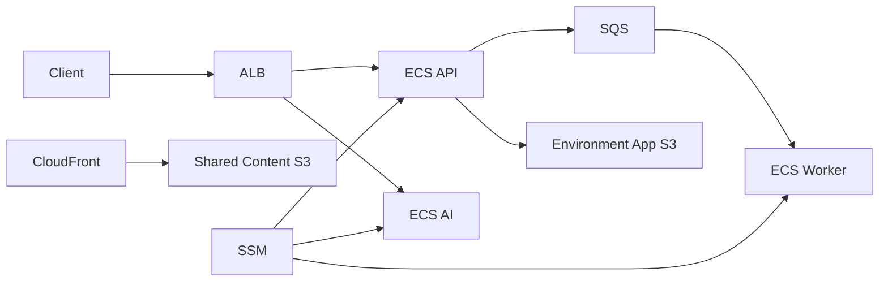

# Landit IaC GitHub Wiki Implementation Plan

> **For agentic workers:** REQUIRED SUB-SKILL: Use superpowers:subagent-driven-development (recommended) or superpowers:executing-plans to implement this plan task-by-task. Steps use checkbox (`- [ ]`) syntax for tracking.

**Goal:** 신규 합류자와 인프라 운영자가 Landit 인프라를 이해하고 안전하게 작업할 수 있는 전체 GitHub Wiki를 작성하고 게시한다.

**Architecture:** 최신 `origin/main`의 Terraform, workflow, 운영 문서를 기준 소스로 삼고 별도 `landit-iac.wiki.git` 저장소에 역할별 Markdown 페이지를 작성한다. Wiki는 온보딩, 구조, 일상 운영, 장애 대응을 분리하며 `_Sidebar.md`로 연결한다. 실제 운영 상태를 단정하는 문장은 읽기 전용 검증 근거가 있을 때만 사용한다.

**Tech Stack:** GitHub Wiki, Markdown, Git, Terraform, AWS CLI, curl, ripgrep.

## Global Constraints

- 작업 시작 시 `git fetch origin`으로 최신 `origin/main`을 확인한다.
- Wiki 파일은 `Home.md`, `Getting-Started.md`, `Infrastructure-Architecture.md`, `Terraform-Operations.md`, `Secrets-and-Configuration.md`, `Observability.md`, `Content-Delivery.md`, `Troubleshooting.md`, `Architecture-Decisions.md`, `_Sidebar.md`만 만든다.
- Wiki 본문은 한국어로 작성하고 한국어 문장을 마침표, 물음표, 느낌표로 끝낸다.
- README와 `docs/`를 그대로 복제하지 않고 사용 흐름에 맞게 요약하고 기준 소스를 연결한다.
- 코드와 문서가 다르면 최신 `origin/main`의 Terraform과 workflow를 우선한다.
- 실제 AWS 상태를 확인하지 않은 리소스는 `적용 완료`라고 쓰지 않는다.
- secret 값, token, 접근 키, private key, DB credential, 내부 IP, security group ID를 Wiki에 기록하지 않는다.
- Terraform apply, AWS 리소스 변경, SSM 값 변경, Grafana 변경은 수행하지 않는다.
- Wiki `master` push 전 로컬 변경과 검증 결과를 사용자에게 제시하고 게시 승인을 받는다.
- 설계 기준은 `docs/superpowers/specs/2026-07-18-landit-iac-wiki-design.md`다.

---

### Task 1: Wiki 기준선과 온보딩 페이지 작성

**Files:**
- Replace: `/tmp/landit-iac-wiki-authoring/Home.md`
- Create: `/tmp/landit-iac-wiki-authoring/Getting-Started.md`
- Reference: `README.md`
- Reference: `docs/developer-guide.md`
- Reference: `AGENTS.md`

**Interfaces:**
- Consumes: 최신 `origin/main`의 README, 개발자 가이드, Git 작업 규칙.
- Produces: 나머지 페이지의 기준 시점과 독자별 진입점을 제공하는 Home, 첫 plan까지 안내하는 Getting Started.

- [ ] **Step 1: 최신 소스와 Wiki 원격 상태를 확인한다.**

Run:

```bash
git fetch origin
git rev-parse --short origin/main
git status --short
git ls-remote https://github.com/Aragornnnnnn/landit-iac.wiki.git HEAD
```

Expected: `origin/main` SHA와 Wiki `HEAD` SHA가 출력되고, 소스 저장소에는 계획 문서 이후의 예상하지 않은 변경이 없다.

- [ ] **Step 2: 깨끗한 Wiki 작성 저장소를 준비한다.**

Run:

```bash
test ! -e /tmp/landit-iac-wiki-authoring
git clone https://github.com/Aragornnnnnn/landit-iac.wiki.git /tmp/landit-iac-wiki-authoring
git -C /tmp/landit-iac-wiki-authoring status --short
git -C /tmp/landit-iac-wiki-authoring branch --show-current
git -C /tmp/landit-iac-wiki-authoring tag wiki-before-rewrite
```

Expected: clone 직후 변경이 없고 branch는 `master`다. 기존 파일은 `Home.md` 한 장이며 현재 원격 기준을 `wiki-before-rewrite` local tag로 남긴다.

- [ ] **Step 3: Home을 저장소 안내 페이지로 교체한다.**

`Home.md`에 아래 순서로 작성한다.

```markdown
# Landit IaC Wiki

## 한 줄 설명
## 현재 기준
## 관리 범위
## 환경과 Terraform root
## 문서 안내
## 기준 소스
## 갱신 원칙
```

반드시 포함할 내용은 다음과 같다.

- Landit의 Terraform backend, shared 콘텐츠 제공, develop·production ECS Fargate application platform을 관리한다.
- 기준 branch는 `main`이고 기준 commit은 Step 1에서 확인한 최신 `origin/main` SHA다.
- `bootstrap/state-backend`, `environments/shared`, `environments/dev`, `environments/prod`의 역할을 표로 구분한다.
- Wiki 8개 본문 페이지를 독자의 목적과 함께 연결한다.
- 구현과 Wiki가 다르면 최신 `origin/main`의 코드와 workflow를 우선한다.
- 검증하지 않은 운영 상태는 현재 상태로 단정하지 않는다.

- [ ] **Step 4: Getting Started를 작성한다.**

`Getting-Started.md`에 아래 순서로 작성한다.

```markdown
# Getting Started

## 준비할 도구
## 저장소와 기준 문서
## AWS 인증 확인
## Terraform root 선택
## 첫 검증
## 첫 plan
## 작업 전 확인
## 자주 막히는 지점
```

반드시 포함할 내용은 다음과 같다.

- Terraform, AWS CLI, Git이 필요하다.
- AWS profile은 `landit`, region은 `ap-northeast-2`다.
- account 확인은 `AWS_PROFILE=landit aws sts get-caller-identity`로 하되 account ID를 Wiki에 복제하지 않는다.
- 일반 작업은 `shared`, `develop`, `production` 중 하나를 고르고 `bootstrap`은 state backend 관리자 작업에만 사용한다.
- 첫 검증은 `terraform fmt -recursive -check`, root별 `terraform init`, `terraform validate` 순서다.
- 첫 plan은 `AWS_PROFILE=landit terraform -chdir=environments/dev plan` 예시를 제공한다.
- `terraform apply`는 plan 검토와 사용자 확인 뒤에만 실행한다.
- `.tfvars`, `.tfplan`, state, secret 값은 커밋하지 않는다.

- [ ] **Step 5: 온보딩 페이지를 검증한다.**

Run:

```bash
test -s /tmp/landit-iac-wiki-authoring/Home.md
test -s /tmp/landit-iac-wiki-authoring/Getting-Started.md
rg -n '^# |^## ' /tmp/landit-iac-wiki-authoring/Home.md /tmp/landit-iac-wiki-authoring/Getting-Started.md
git -C /tmp/landit-iac-wiki-authoring diff --check
```

Expected: 두 파일의 H1과 모든 필수 H2가 출력되고 `git diff --check`가 exit code `0`이다.

- [ ] **Step 6: 온보딩 페이지를 커밋한다.**

```bash
git -C /tmp/landit-iac-wiki-authoring add Home.md Getting-Started.md
git -C /tmp/landit-iac-wiki-authoring commit -m "docs: IaC Wiki 시작과 온보딩 문서 작성"
```

Expected: 두 파일만 포함한 새 커밋이 생성된다.

### Task 2: 인프라 구조와 아키텍처 결정 페이지 작성

**Files:**
- Create: `/tmp/landit-iac-wiki-authoring/Infrastructure-Architecture.md`
- Create: `/tmp/landit-iac-wiki-authoring/Architecture-Decisions.md`
- Reference: `environments/dev/main.tf`
- Reference: `environments/prod/main.tf`
- Reference: `environments/shared/main.tf`
- Reference: `modules/app-platform/main.tf`
- Reference: `modules/app-platform/outputs.tf`
- Reference: `docs/architecture-questions.md`

**Interfaces:**
- Consumes: Terraform root, module, output, 아키텍처 질문.
- Produces: 서비스 관계를 설명하는 구조 페이지와 확정·보류 결정을 분리한 ADR 진입점.

- [ ] **Step 1: Terraform이 실제로 정의하는 구성요소를 목록으로 확인한다.**

Run:

```bash
rg -n '^resource |^module |^output ' environments modules
rg -n '^## ' docs/architecture-questions.md
```

Expected: dev·prod의 `app_platform` module, shared S3·CloudFront, app platform의 VPC·ALB·ECS·ECR·SQS·S3 리소스와 output이 확인된다.

- [ ] **Step 2: Infrastructure Architecture를 작성한다.**

`Infrastructure-Architecture.md`에 아래 순서로 작성한다.

```markdown
# Infrastructure Architecture

## 전체 구조
## Terraform root와 state 소유권
## Develop과 Production
## 요청 흐름
## 비동기 작업 흐름
## 스토리지 경계
## Runtime 설정 흐름
## Terraform 관리 범위 밖
```

`전체 구조`에는 Mermaid flowchart를 넣고 다음 관계만 표시한다.



내부 IP, security group ID, secret 값은 다이어그램과 본문에서 제외한다. DNS record는 Vercel 관리 범위이고 Terraform이 Route53 record를 만들지 않는다고 적는다.

- [ ] **Step 3: Architecture Decisions를 작성한다.**

`Architecture-Decisions.md`에 아래 순서로 작성한다.

```markdown
# Architecture Decisions

## 문서 목적
## 확정된 결정
## 보류 중인 결정
## ADR 작성 형식
## 변경 기록 위치
```

확정된 결정에는 환경별 state 분리, shared state 분리, ECS Fargate application platform, SSM 외부 값 관리, 수동 plan·승인 apply, Vercel DNS 관리, private S3와 CloudFront OAC를 포함한다. 보류 항목은 `docs/architecture-questions.md`에서 현재 코드로 확정되지 않은 항목만 옮긴다. ADR 형식은 `배경`, `결정`, `대안`, `영향`, `검증` 다섯 항목으로 고정한다.

- [ ] **Step 4: 구조 페이지를 검증하고 커밋한다.**

Run:

```bash
rg -n '^# |^## |^```mermaid|flowchart LR' /tmp/landit-iac-wiki-authoring/Infrastructure-Architecture.md /tmp/landit-iac-wiki-authoring/Architecture-Decisions.md
git -C /tmp/landit-iac-wiki-authoring diff --check
git -C /tmp/landit-iac-wiki-authoring add Infrastructure-Architecture.md Architecture-Decisions.md
git -C /tmp/landit-iac-wiki-authoring commit -m "docs: 인프라 구조와 아키텍처 결정 정리"
```

Expected: 필수 heading과 Mermaid 시작점이 출력되고 두 파일만 커밋된다.

### Task 3: Terraform과 Runtime 설정 운영 페이지 작성

**Files:**
- Create: `/tmp/landit-iac-wiki-authoring/Terraform-Operations.md`
- Create: `/tmp/landit-iac-wiki-authoring/Secrets-and-Configuration.md`
- Reference: `.github/workflows/terraform.yml`
- Reference: `docs/developer-guide.md`
- Reference: `docs/ssm-parameters.md`
- Reference: `modules/app-platform/main.tf`

**Interfaces:**
- Consumes: 로컬 Terraform 명령, GitHub Actions 입력과 승인 조건, SSM registry와 ECS secret mapping.
- Produces: 정상 변경 절차와 runtime 설정 반영 절차.

- [ ] **Step 1: workflow와 SSM 주입 계약을 다시 확인한다.**

Run:

```bash
rg -n 'target:|operation:|confirm_environment:|environment: terraform-|Require main|Require production|Terraform (fmt|init|validate|plan|apply)' .github/workflows/terraform.yml
rg -n '^\| `/landit/|새 parameter 추가 절차|새 deployment' docs/ssm-parameters.md
rg -n 'secrets = \[' modules/app-platform/main.tf
```

Expected: `shared`, `develop`, `production`, `plan-only`, `plan-and-apply`, main 제한, production 확인, SSM registry, task definition secret block이 확인된다.

- [ ] **Step 2: Terraform Operations를 작성한다.**

`Terraform-Operations.md`에 아래 순서로 작성한다.

```markdown
# Terraform Operations

## 작업 원칙
## Root별 로컬 실행
## GitHub Actions 입력
## Plan 흐름
## Apply 승인 조건
## 변경 유형별 검증
## Git 작업 흐름
```

root별 명령은 `bootstrap`, `shared`, `dev`, `prod`를 각각 완전한 코드 블록으로 적는다. GitHub Actions 표에는 target 3개, operation 2개, production의 `confirm_environment=production` 조건을 적는다. apply는 `refs/heads/main`, target별 required reviewer, 같은 plan artifact 사용 조건을 모두 충족해야 한다고 명시한다.

- [ ] **Step 3: Secrets and Configuration을 작성한다.**

`Secrets-and-Configuration.md`에 아래 순서로 작성한다.

```markdown
# Secrets and Configuration

## 기본 원칙
## SSM 경로
## Parameter 분류
## SSM에서 Container까지
## 새 Parameter 추가
## 기존 값 변경
## 안전한 검증
## 금지 사항
```

parameter는 이름, `String` 또는 `SecureString`, 소비 서비스, ECS 환경변수 이름만 적는다. 값은 적지 않는다. `SSM 생성 -> Terraform task definition secrets 연결 -> plan/apply -> 새 task definition -> ECS deployment -> 실제 사용 경로 검증` 흐름을 Mermaid 또는 번호 목록으로 제공한다. 기존 값만 바꿔도 running task에는 자동 반영되지 않는다고 명시한다.

- [ ] **Step 4: 운영 페이지를 검증하고 커밋한다.**

Run:

```bash
rg -n '^# |^## ' /tmp/landit-iac-wiki-authoring/Terraform-Operations.md /tmp/landit-iac-wiki-authoring/Secrets-and-Configuration.md
rg -n 'plan-only|plan-and-apply|confirm_environment=production|새 deployment' /tmp/landit-iac-wiki-authoring/Terraform-Operations.md /tmp/landit-iac-wiki-authoring/Secrets-and-Configuration.md
git -C /tmp/landit-iac-wiki-authoring diff --check
git -C /tmp/landit-iac-wiki-authoring add Terraform-Operations.md Secrets-and-Configuration.md
git -C /tmp/landit-iac-wiki-authoring commit -m "docs: Terraform과 설정 운영 절차 정리"
```

Expected: 승인 조건과 재배포 조건이 검색되고 두 파일만 커밋된다.

### Task 4: 관측성과 콘텐츠 제공 페이지 작성

**Files:**
- Create: `/tmp/landit-iac-wiki-authoring/Observability.md`
- Create: `/tmp/landit-iac-wiki-authoring/Content-Delivery.md`
- Reference: `docs/observability.md`
- Reference: `grafana/dashboards/landit-overview.json`
- Reference: `grafana/dashboards/landit-be.json`
- Reference: `grafana/dashboards/landit-ai.json`
- Reference: `scripts/sync-grafana-dashboards.sh`
- Reference: `docs/content-storage.md`
- Reference: `environments/shared/main.tf`

**Interfaces:**
- Consumes: 메트릭·로그 전송 구조, dashboard 운영 절차, shared 콘텐츠 구조.
- Produces: 관측성 운영 안내와 공통 콘텐츠 교체 Runbook.

- [ ] **Step 1: 관측성과 콘텐츠 기준을 확인한다.**

Run:

```bash
rg -n '^## |Grafana Cloud|OTLP|CloudWatch|Firehose|Loki|Sentry' docs/observability.md
rg -n '^## |content/|CloudFront|immutable|Cache-Control' docs/content-storage.md
rg -n '^resource "aws_(s3|cloudfront)|content/\*|default_ttl|max_ttl' environments/shared/main.tf
```

Expected: OTLP 메트릭, CloudWatch Logs와 Firehose, Grafana dashboard, private S3, OAC, `content/*`, 1년 cache 기준이 확인된다.

- [ ] **Step 2: Observability를 작성한다.**

`Observability.md`에 아래 순서로 작성한다.

```markdown
# Observability

## 데이터 흐름
## Sentry
## 애플리케이션 메트릭
## 로그
## Grafana Dashboard
## 인증과 Token
## 검증
## 현재 범위 밖
```

BE·AI 애플리케이션 메트릭은 OTLP로 직접 전송하고, 로그는 CloudWatch Logs에서 Data Firehose를 거쳐 Grafana Loki로 전달한다고 적는다. `Landit Overview`, `Landit BE`, `Landit AI` dashboard 목적을 구분한다. CloudWatch scrape 기반 ALB·ECS 인프라 지표는 조직 권한 제약으로 현재 범위 밖이라고 적는다. 임시 token은 환경변수로만 전달하고 동기화 후 폐기하는 절차를 연결한다.

- [ ] **Step 3: Content Delivery를 작성한다.**

`Content-Delivery.md`에 아래 순서로 작성한다.

```markdown
# Content Delivery

## 책임 범위
## 저장 구조
## 조회 흐름
## Cache 정책
## 새 파일 게시
## 기존 파일 교체
## 삭제 조건
## Application Bucket과의 구분
```

shared private S3 bucket은 공통 콘텐츠 이미지만 저장하고 CloudFront OAC만 `content/*`를 읽는다고 적는다. 게시 절차는 UUID 기반 새 key, `Cache-Control: public, max-age=31536000, immutable`, CloudFront URL 확인, DB URL 변경, 참조 전환과 cache 기간 확인 뒤 이전 객체 삭제 순서로 고정한다. 실제 bucket 이름과 CloudFront distribution ID는 쓰지 않는다.

- [ ] **Step 4: 관측성과 콘텐츠 페이지를 검증하고 커밋한다.**

Run:

```bash
rg -n '^# |^## ' /tmp/landit-iac-wiki-authoring/Observability.md /tmp/landit-iac-wiki-authoring/Content-Delivery.md
rg -n 'OTLP|Data Firehose|Grafana Loki|content/\*|31536000|immutable' /tmp/landit-iac-wiki-authoring/Observability.md /tmp/landit-iac-wiki-authoring/Content-Delivery.md
git -C /tmp/landit-iac-wiki-authoring diff --check
git -C /tmp/landit-iac-wiki-authoring add Observability.md Content-Delivery.md
git -C /tmp/landit-iac-wiki-authoring commit -m "docs: 관측성과 콘텐츠 제공 절차 정리"
```

Expected: 핵심 데이터 흐름과 cache 기준이 검색되고 두 파일만 커밋된다.

### Task 5: 장애 대응과 Wiki 탐색 구조 작성

**Files:**
- Create: `/tmp/landit-iac-wiki-authoring/Troubleshooting.md`
- Create: `/tmp/landit-iac-wiki-authoring/_Sidebar.md`
- Modify: `/tmp/landit-iac-wiki-authoring/Home.md`
- Reference: `context-notes.md`
- Reference: `.github/workflows/terraform.yml`
- Reference: `docs/ssm-parameters.md`
- Reference: `docs/observability.md`

**Interfaces:**
- Consumes: 이전 작업에서 만든 모든 Wiki 페이지와 검증된 장애 확인 순서.
- Produces: 증상별 Runbook, 전체 탐색 메뉴, 누락 없는 Home 문서 안내.

- [ ] **Step 1: Troubleshooting을 작성한다.**

`Troubleshooting.md`에 아래 문제를 각각 `증상`, `먼저 확인`, `명령`, `정상 기준`, `다음 조치` 순서로 작성한다.

```markdown
# Troubleshooting

## Backend initialization required
## AWS 인증 또는 OIDC 오류
## Plan에 예상하지 않은 변경이 있음
## ECS task가 시작되지 않음
## ALB target이 unhealthy임
## SSM 변경이 Container에 반영되지 않음
## CORS 또는 인증 설정이 누락됨
## Grafana에 메트릭이 없음
## Grafana에 로그가 없음
## CloudFront 콘텐츠가 갱신되지 않음
## 문서와 코드가 다름
```

ECS 문제는 ECR image 존재, stopped task reason, service deployment, target health 순서로 확인한다. SSM 문제는 parameter 존재, task definition `secrets`, 새 deployment 순서로 확인한다. Grafana 문제는 애플리케이션 전송 오류, Firehose 상태, label과 시간 범위 순서로 확인한다. 하나의 원인으로 단정하지 않는다.

- [ ] **Step 2: Sidebar를 작성한다.**

`_Sidebar.md`를 다음 구조로 작성한다.

```markdown
## Landit IaC

- [Home](Home)

### 시작하기

- [Getting Started](Getting-Started)

### 구조 이해하기

- [Infrastructure Architecture](Infrastructure-Architecture)
- [Architecture Decisions](Architecture-Decisions)

### 작업하고 운영하기

- [Terraform Operations](Terraform-Operations)
- [Secrets and Configuration](Secrets-and-Configuration)
- [Observability](Observability)
- [Content Delivery](Content-Delivery)
- [Troubleshooting](Troubleshooting)

## Repository

- [Source Code](https://github.com/Aragornnnnnn/landit-iac)
- [Actions](https://github.com/Aragornnnnnn/landit-iac/actions)
- [Pull Requests](https://github.com/Aragornnnnnn/landit-iac/pulls)
```

- [ ] **Step 3: Home 문서 안내와 실제 페이지를 대조한다.**

Home의 문서 안내에 본문 페이지 8개가 모두 있고 이름과 링크가 Sidebar와 같은지 확인한다. 누락이나 다른 이름이 있으면 Home만 수정한다.

- [ ] **Step 4: 장애 대응과 탐색 구조를 검증하고 커밋한다.**

Run:

```bash
rg -n '^# |^## ' /tmp/landit-iac-wiki-authoring/Troubleshooting.md /tmp/landit-iac-wiki-authoring/_Sidebar.md
for page in Home Getting-Started Infrastructure-Architecture Architecture-Decisions Terraform-Operations Secrets-and-Configuration Observability Content-Delivery Troubleshooting; do rg -q "($page)" /tmp/landit-iac-wiki-authoring/_Sidebar.md; done
git -C /tmp/landit-iac-wiki-authoring diff --check
git -C /tmp/landit-iac-wiki-authoring add Troubleshooting.md _Sidebar.md Home.md
git -C /tmp/landit-iac-wiki-authoring commit -m "docs: 장애 대응과 Wiki 탐색 구조 정리"
```

Expected: 모든 내부 페이지 link가 Sidebar에 있고 변경 파일 3개 이하로 커밋된다.

### Task 6: 전체 로컬 검증과 게시 전 검토

**Files:**
- Verify: `/tmp/landit-iac-wiki-authoring/*.md`
- Compare: `docs/superpowers/specs/2026-07-18-landit-iac-wiki-design.md`

**Interfaces:**
- Consumes: Task 1부터 Task 5까지 만든 Wiki 커밋.
- Produces: 게시 가능한 로컬 Wiki와 사용자 검토용 diff·검증 결과.

- [ ] **Step 1: 파일 집합과 Git 상태를 확인한다.**

Run:

```bash
git -C /tmp/landit-iac-wiki-authoring status --short
find /tmp/landit-iac-wiki-authoring -maxdepth 1 -name '*.md' -print | sort
git -C /tmp/landit-iac-wiki-authoring log --oneline --max-count=6
```

Expected: Markdown 파일은 Global Constraints의 10개뿐이고 working tree는 깨끗하다. Wiki 작성 커밋 5개와 기존 초기 Home 커밋이 보인다.

- [ ] **Step 2: 필수 페이지, heading, 링크를 검증한다.**

Run:

```bash
for file in Home.md Getting-Started.md Infrastructure-Architecture.md Terraform-Operations.md Secrets-and-Configuration.md Observability.md Content-Delivery.md Troubleshooting.md Architecture-Decisions.md _Sidebar.md; do test -s "/tmp/landit-iac-wiki-authoring/$file"; done
for file in Home.md Getting-Started.md Infrastructure-Architecture.md Terraform-Operations.md Secrets-and-Configuration.md Observability.md Content-Delivery.md Troubleshooting.md Architecture-Decisions.md; do test "$(rg -c '^# ' "/tmp/landit-iac-wiki-authoring/$file")" -eq 1; done
for page in Home Getting-Started Infrastructure-Architecture Architecture-Decisions Terraform-Operations Secrets-and-Configuration Observability Content-Delivery Troubleshooting; do rg -q "($page)" /tmp/landit-iac-wiki-authoring/_Sidebar.md; done
```

Expected: 모든 명령이 exit code `0`으로 끝난다.

- [ ] **Step 3: 민감정보와 문서 품질을 검증한다.**

Run:

```bash
git -C /tmp/landit-iac-wiki-authoring diff wiki-before-rewrite..HEAD --check
if rg -n 'AKIA[0-9A-Z]{16}|gh[pousr]_[A-Za-z0-9_]{20,}|sk-[A-Za-z0-9]{20,}|Bearer [A-Za-z0-9._-]{20,}|BEGIN (RSA |OPENSSH )?PRIVATE KEY' /tmp/landit-iac-wiki-authoring/*.md; then exit 1; fi
if rg -n 'TBD|TODO|FIXME' /tmp/landit-iac-wiki-authoring/*.md; then exit 1; fi
```

Expected: whitespace error, 민감정보 패턴, placeholder가 없다.

- [ ] **Step 4: 최신 source path와 주요 계약을 대조한다.**

Run:

```bash
for path in bootstrap/state-backend environments/shared environments/dev environments/prod modules/app-platform .github/workflows/terraform.yml docs/ssm-parameters.md docs/observability.md docs/content-storage.md; do test -e "$path"; done
rg -n 'shared|develop|production|plan-only|plan-and-apply' .github/workflows/terraform.yml
rg -n '새 deployment|task definition' docs/ssm-parameters.md
```

Expected: Wiki가 참조한 모든 source path가 존재하고 workflow·SSM 핵심 계약이 최신 코드에서 확인된다.

- [ ] **Step 5: 게시 전 검토 자료를 사용자에게 제시한다.**

Run:

```bash
git -C /tmp/landit-iac-wiki-authoring diff --stat wiki-before-rewrite..HEAD
git -C /tmp/landit-iac-wiki-authoring log --oneline --reverse wiki-before-rewrite..HEAD
```

Expected: 파일별 변경량과 Wiki 작성 커밋 5개가 출력된다. 페이지 구성, 검증 결과, 아직 push하지 않았다는 상태를 사용자에게 보고하고 게시 승인을 기다린다.

### Task 7: Wiki 게시와 게시 후 결과 기록

**Files:**
- Publish: `/tmp/landit-iac-wiki-authoring/*.md`
- Modify: `checklist.md`
- Modify: `context-notes.md`

**Interfaces:**
- Consumes: 사용자가 게시를 승인한 깨끗한 Wiki `master`.
- Produces: GitHub에 게시된 Wiki 9개 페이지와 Sidebar, 게시 검증 기록.

- [ ] **Step 1: 원격 변경 여부를 마지막으로 확인한다.**

Run:

```bash
git -C /tmp/landit-iac-wiki-authoring fetch origin
git -C /tmp/landit-iac-wiki-authoring rev-list --left-right --count HEAD...origin/master
git -C /tmp/landit-iac-wiki-authoring status --short
```

Expected: local은 작성 커밋 수만큼 ahead이고 behind는 `0`이며 working tree가 깨끗하다. behind가 0이 아니면 push하지 않고 원격 변경을 검토한다.

- [ ] **Step 2: Wiki master를 게시한다.**

Run:

```bash
git -C /tmp/landit-iac-wiki-authoring push origin master
```

Expected: `master`가 새 Wiki HEAD로 fast-forward된다.

- [ ] **Step 3: 게시된 페이지 응답을 확인한다.**

Run:

```bash
for page in Home Getting-Started Infrastructure-Architecture Terraform-Operations Secrets-and-Configuration Observability Content-Delivery Troubleshooting Architecture-Decisions; do curl -L -sS -o /dev/null -w "$page %{http_code}\n" "https://github.com/Aragornnnnnn/landit-iac/wiki/$page"; done
```

Expected: 9개 페이지가 모두 HTTP `200`을 반환한다.

- [ ] **Step 4: 게시 결과를 소스 저장소 기록에 반영한다.**

`checklist.md`의 Wiki 작업 항목을 실제 상태에 맞게 완료 처리한다. `context-notes.md`에는 Wiki HEAD SHA, 게시 시각, 9개 HTTP 응답 결과, 검증 명령, 남은 위험을 기록한다. secret 값이나 내부 식별자는 기록하지 않는다.

- [ ] **Step 5: 소스 저장소 기록을 검증하고 커밋한다.**

Run:

```bash
git diff --check
git status --short
git diff -- checklist.md context-notes.md
git add checklist.md context-notes.md
git commit -m "docs: GitHub Wiki 게시 결과 기록"
```

Expected: 두 기록 파일만 포함한 커밋이 생성된다. `feat/wiki` push와 Pull Request 생성은 사용자가 별도로 요청할 때 진행한다.
